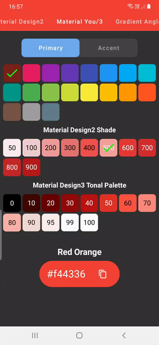
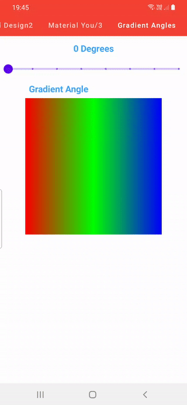
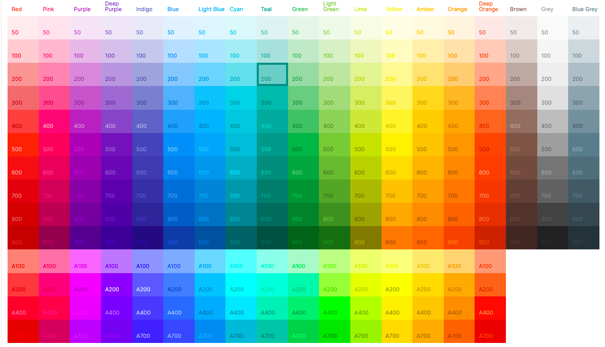

# Jetpack Compose Extended Colors

[](https://jitpack.io/#SmartToolFactory/Compose-Extended-Colors)

* Utility library that extends Compose Colors with Material Design2 colors, Color swatches like in
  [Flutter](https://api.flutter.dev/flutter/material/Colors-class.html).

* Material Design 3 tonal and Core palettes,
  see [Material Design 3 site](https://m3.material.io/styles/color/the-color-system/key-colors-tones)
  for more information about the Material 3 color system and tonal palettes.

* Rotatable gradients by 45 degrees with aim to add rotation by any angle in the future

* Functions to convert between `androidx.compose.ui.graphics.Color`, `HSL`, `HSV`, `RGB`, `HCT`, and
  colors with  **Name** based on distance to pre-defined elements in json in 3D space using `Red`
  , `Green`, `Blue` values of picked Color.

| M2 Color Swatches                                          | M3 Tone Palettes                                           | Gradient Rotation                                           |
|------------------------------------------------------------|------------------------------------------------------------|-------------------------------------------------------------|
|  |  |  |

## Gradle Setup

To get a Git project into your build:

* Step 1. Add the JitPack repository to your build file Add it in your root build.gradle at the end
  of repositories:

```
allprojects {
  repositories {
      ...
      maven { url 'https://jitpack.io' }
  }
}
```

* Step 2. Add the dependency

```
dependencies {
    implementation 'com.github.SmartToolFactory:Compose-Extended-Colors:<version>'
}
```


## Material Design 2 Colors & Swatches

### Material Colors



[Material Colors](https://materialui.co/colors/) can be accessed from Red to BlueGrey. Brown, Grey, and
BlueGrey swatches only have primary colors.

```kotlin
val Red50 = Color(0xffFFEBEE)
val Red100 = Color(0xffFFCDD2)
val Red200 = Color(0xffEF9A9A)
val Red300 = Color(0xffE57373)
val Red400 = Color(0xffEF5350)
val Red500 = Color(0xffF44336)
val Red600 = Color(0xffE53935)
val Red700 = Color(0xffD32F2F)
val Red800 = Color(0xffC62828)
val Red900 = Color(0xffB71C1C)

// Accent Colors
val RedA100 = Color(0xffFF8A80)
val RedA200 = Color(0xffFF5252)
val RedA400 = Color(0xffFF1744)
val RedA700 = Color(0xffD50000)
```

### Material Swatches

Call any swatch from `ColorSwatch` for instance for Red500 with `ColorSwatch.red` which will return
primary color `Map<Int,Color>`

```kotlin
  val red by lazy {
    linkedMapOf(
        50 to Color(0xffFFEBEE),
        100 to Color(0xffFFCDD2),
        200 to Color(0xffEF9A9A),
        300 to Color(0xffE57373),
        400 to Color(0xffEF5350),
        500 to Color(0xffF44336),
        600 to Color(0xffE53935),
        700 to Color(0xffD32F2F),
        800 to Color(0xffC62828),
        900 to Color(0xffB71C1C)
    )
}
```

to access any color from this map

```
val redSwatch = ColorSwatch.red
val red300 = redSwatch[300]!!
```

Swatch that returns header(50 variants)

```kotlin
val primaryHeaderColors by lazy {
    listOf(
        Color(0xffF44336),
        Color(0xffE91E63),
        Color(0xff9C27B0),
        Color(0xff673AB7),
        Color(0xff3F51B5),
        Color(0xff2196F3),
        Color(0xff03A9F4),
        Color(0xff00BCD4),
        Color(0xff00ACC1),
        Color(0xff4CAF50),
        Color(0xff8BC34A),
        Color(0xffCDDC39),
        Color(0xffFFEB3B),
        Color(0xffFFC107),
        Color(0xffFF9800),
        Color(0xffFF5722),
        Color(0xff795548),
        Color(0xff9E9E9E),
        Color(0xff607D8B)
    )
}
```

## Material Design 3 Tonal Palette

A tonal palette consists of thirteen tones, including white and black. A tone value of 100 is
equivalent to the idea of light at its maximum and results in white. Every tone value between 0 and
100 expresses the amount of light present in the color.


From range 0 to 100

```kotlin
val material3ToneRange = listOf(
    0, 10, 20, 30, 40, 50, 60, 70, 80, 90, 95, 99, 100
)

```

Call that returns list of colors

```kotlin
fun getColorTonesList(color: Color): List<Color> {

    val camColor = Cam16.fromInt(color.toArgb())
    val palette: TonalPalette =
        TonalPalette.fromHueAndChroma(camColor.hue, max(48.0, camColor.chroma))
    val toneList = mutableListOf<Color>()

    material3ToneRange.forEach { shade ->
        toneList.add(Color(palette.tone(shade)))
    }

    return toneList
}
```

 or to get Map with tone keys

```kotlin
fun getColorTonesMap(color: Color): Map<Int, Color> {
    val palette: TonalPalette = TonalPalette.fromInt(color.toArgb())
    val toneMap = linkedMapOf<Int, Color>()

    material3ToneRange.forEach { shade ->
        toneMap[shade] = Color(palette.tone(shade))
    }

    return toneMap
}

```


## Gradient Rotation

Gradients can be rotate by 45, in the future this can be expanded to any angle, with

Create a `GradientOffset`with

```kotlin
var gradientOffset by remember {
    mutableStateOf(GradientOffset(GradientAngle.CW0))
}
```

```kotlin
fun GradientOffset(angle: GradientAngle = GradientAngle.CW0): GradientOffset {
    return when (angle) {
        GradientAngle.CW45 -> GradientOffset(
            start = Offset.Zero,
            end = Offset.Infinite
        )
        GradientAngle.CW90 -> GradientOffset(
            start = Offset.Zero,
            end = Offset(0f, Float.POSITIVE_INFINITY)
        )
        GradientAngle.CW135 -> GradientOffset(
            start = Offset(Float.POSITIVE_INFINITY, 0f),
            end = Offset(0f, Float.POSITIVE_INFINITY)
        )
        GradientAngle.CW180 -> GradientOffset(
            start = Offset(Float.POSITIVE_INFINITY, 0f),
            end = Offset.Zero,
        )
        GradientAngle.CW225 -> GradientOffset(
            start = Offset.Infinite,
            end = Offset.Zero
        )
        GradientAngle.CW270 -> GradientOffset(
            start = Offset(0f, Float.POSITIVE_INFINITY),
            end = Offset.Zero
        )
        GradientAngle.CW315 -> GradientOffset(
            start = Offset(0f, Float.POSITIVE_INFINITY),
            end = Offset(Float.POSITIVE_INFINITY, 0f)
        )
        else -> GradientOffset(
            start = Offset.Zero,
            end = Offset(Float.POSITIVE_INFINITY, 0f)
        )
    }
}
```

Set start and end of `Brush` with

```kotlin
val redGreenGradient = Brush.linearGradient(
    colors = listOf(Color.Red, Color.Green, Color.Blue),
    start = gradientOffset.start,
    end = gradientOffset.end
)
```

## Color Names
Create an instance of `ColorNameParser` with

```kotlin
@Composable
fun rememberColorParser(): ColorNameParser {
    return remember {
        ColorNameParser()
    }
}
```
And call `ColorNameParser.parseColor(color)`

Call it in a launchedEffect with snapshotFlow or in a ViewModel or UseCase

```kotlin
LaunchedEffect(key1 = colorNameParser) {

    snapshotFlow { color }
        .distinctUntilChanged()
        .mapLatest { color: Color ->
            colorNameParser.parseColorName(color)
        }
        .flowOn(Dispatchers.Default)
        .collect { name: String ->
            colorName = name
        }
}
```


## Conversions

You can use `ColorItem` which has functions that enables user to convert from `Color` to
other type

```kotlin
/**
 * Data class that wraps [Color] and contains extend information about this color such
 * as HSL, HSV, RGB, HEX counterparts.
 */
data class ColorItem(var color: Color) {
    val hexARGB
        get() = colorToHexAlpha(color)

    val hex
        get() = colorToHex(color)

    val hsvArray
        get() = colorToHSV(color)

    val hslArray
        get() = colorToHSL(color)

    val rgb
        get() = colorToARGBArray(color)

    val alpha:Float
        get() = color.alpha

    val red: Int
        get() = color.red.fractionToRGBRange()

    val green: Int
        get() = color.green.fractionToRGBRange()

    val blue: Int
        get() = color.blue.fractionToRGBRange()

    var label: String = Unspecified

    companion object {
        const val Unspecified = "?????"
    }
}
```

You can also convert between `Color`, `HSL`, `HSV`, `RGB`,  and
colors with  utility functions. call color model you want to conveert from,  `to` then the
color model you want to convert to

### Color Conversion

```kotlin

/**
 * Convert Jetpack Compose [Color] to HSV (hue-saturation-value) components.
 * ```
* Hue is [0 .. 360)
* Saturation is [0...1]
* Value is [0...1]
* ```
* @param hslIn 3 element array which holds the input HSL components.
  */
  fun colorToHSV(color: Color, hslIn: FloatArray) {
  val rgbArray: IntArray = colorIntToRGBArray(color.toArgb())
  val red = rgbArray[0]
  val green = rgbArray[1]
  val blue = rgbArray[2]
  rgbToHSV(red, green, blue, hslIn)
  }

/**
* Convert Jetpack Compose [Color] to HSV (hue-saturation-value) components.
* ```
* Hue is [0 .. 360)
* Saturation is [0...1]
* Value is [0...1]
* ```
*/
fun colorToHSV(color: Color): FloatArray {
val rgbArray: IntArray = colorIntToRGBArray(color.toArgb())
val red = rgbArray[0]
val green = rgbArray[1]
val blue = rgbArray[2]
return rgbToHSV(red, green, blue)
}

/**
* Convert Jetpack Compose [Color] to HSV (hue-saturation-value) components.
* ```
* hsl[0] is Hue [0 .. 360)
* hsl[1] is Saturation [0...1]
* hsl[2] is Lightness [0...1]
* ```
* @param hslIn 3 element array which holds the input HSL components.
  */
  fun colorToHSL(color: Color, hslIn: FloatArray) {
  val rgbArray: IntArray = colorIntToRGBArray(color.toArgb())
  val red = rgbArray[0]
  val green = rgbArray[1]
  val blue = rgbArray[2]
  rgbToHSL(red, green, blue, hslIn)
  }

/**
* Convert Jetpack Compose [Color] to HSV (hue-saturation-value) components.
* ```
* hsl[0] is Hue [0 .. 360)
* hsl[1] is Saturation [0...1]
* hsl[2] is Lightness [0...1]
* ```
*/
fun colorToHSL(color: Color): FloatArray {
val rgbArray: IntArray = colorIntToRGBArray(color.toArgb())
val red = rgbArray[0]
val green = rgbArray[1]
val blue = rgbArray[2]
return rgbToHSL(red, green, blue)
}

/*
COLOR-RGB Conversions
*/

/**
* Convert Jetpack [Color] into 3 element array of red, green, and blue
  *```
* rgb[0] is Red [0 .. 255]
* rgb[1] is Green [0...255]
* rgb[2] is Blue [0...255]
* ```
* @param color Jetpack Compose [Color]
* @return 3 element array which holds the input RGB components.
  */
  fun colorToARGBArray(color: Color): IntArray {
  return colorIntToRGBArray(color.toArgb())
  }

/**
* Convert Jetpack [Color] into 3 element array of red, green, and blue
  *```
* rgb[0] is Red [0 .. 255]
* rgb[1] is Green [0...255]
* rgb[2] is Blue [0...255]
* ```
* @param color Jetpack Compose [Color]
* @return 3 element array which holds the input RGB components.
  */
  fun colorToRGBArray(color: Color): IntArray {
  return colorIntToRGBArray(color.toArgb())
  }

/**
* Convert Jetpack [Color] into 3 element array of red, green, and blue
  *```
* rgb[0] is Red [0 .. 255]
* rgb[1] is Green [0...255]
* rgb[2] is Blue [0...255]
* ```
* @param color Jetpack Compose [Color]
* @param rgbIn 3 element array which holds the input RGB components.
  */
  fun colorToRGBArray(color: Color, rgbIn: IntArray) {
  val argbArray = colorIntToRGBArray(color.toArgb())
  rgbIn[0] = argbArray[0]
  rgbIn[1] = argbArray[1]
  rgbIn[2] = argbArray[2]
  }


fun colorToHex(color: Color): String {
return rgbToHex(color.red, color.green, color.blue)
}

fun colorToHexAlpha(color: Color): String {
return argbToHex(color.alpha, color.red, color.green, color.blue)
}

/**
* Convert a RGB color in [Integer] form to HSV (hue-saturation-value) components.
*  * For instance, red =255, green =0, blue=0 is -65536
* ```
* hsv[0] is Hue [0 .. 360)
* hsv[1] is Saturation [0...1]
* hsv[2] is Value [0...1]
* ```
*/
fun colorIntToHSV(color: Int): FloatArray {
val hsvOut = floatArrayOf(0f, 0f, 0f)
android.graphics.Color.colorToHSV(color, hsvOut)
return hsvOut
}

/**
* Convert a RGB color in [Integer] form to HSV (hue-saturation-value) components.
*  * For instance, red =255, green =0, blue=0 is -65536
*
* ```
* hsv[0] is Hue [0 .. 360)
* hsv[1] is Saturation [0...1]
* hsv[2] is Value [0...1]
* ```
* @param hsvIn 3 element array which holds the input HSV components.
  */
  fun colorIntToHSV(color: Int, hsvIn: FloatArray) {
  android.graphics.Color.colorToHSV(color, hsvIn)
  }


/**
* Convert RGB color [Integer] to HSL (hue-saturation-lightness) components.
* ```
* hsl[0] is Hue [0 .. 360)
* hsl[1] is Saturation [0...1]
* hsl[2] is Lightness [0...1]
* ```
*/
fun colorIntToHSL(color: Int): FloatArray {
val hslOut = floatArrayOf(0f, 0f, 0f)
ColorUtils.colorToHSL(color, hslOut)
return hslOut
}

/**
* Convert RGB color [Integer] to HSL (hue-saturation-lightness) components.
* ```
* hsl[0] is Hue [0 .. 360)
* hsl[1] is Saturation [0...1]
* hsl[2] is Lightness [0...1]
* ```
*/
fun colorIntToHSL(color: Int, hslIn: FloatArray) {
ColorUtils.colorToHSL(color, hslIn)
}


/*
ColorInt-RGB Conversions
*/
/**
* Convert Color [Integer] into 3 element array of red, green, and blue
  *```
* rgb[0] is Red [0 .. 255]
* rgb[1] is Green [0...255]
* rgb[2] is Blue [0...255]
* ```
* @return 3 element array which holds the input RGB components.
  */
  fun colorIntToRGBArray(color: Int): IntArray {
  val red = android.graphics.Color.red(color)
  val green = android.graphics.Color.green(color)
  val blue = android.graphics.Color.blue(color)
  return intArrayOf(red, green, blue)
  }

/**
* Convert Color [Integer] into 3 element array of red, green, and blue
  *```
* rgb[0] is Red [0 .. 255]
* rgb[1] is Green [0...255]
* rgb[2] is Blue [0...255]
* ```
* @param rgbIn 3 element array which holds the input RGB components.
  */
  fun colorIntToRGBArray(color: Int, rgbIn: IntArray) {
  val red = android.graphics.Color.red(color)
  val green = android.graphics.Color.green(color)
  val blue = android.graphics.Color.blue(color)

  rgbIn[0] = red
  rgbIn[1] = green
  rgbIn[2] = blue
  }

/**
* Convert Color [Integer] into 4 element array of alpha red, green, and blue
  *```
* rgb[0] is Alpha [0 .. 255]
* rgb[1] is Red [0 .. 255]
* rgb[2] is Green [0...255]
* rgb[3] is Blue [0...255]
* ```
* @return 4 element array which holds the input ARGB components.
  */
  fun colorIntToARGBArray(color: Int): IntArray {
  val alpha = android.graphics.Color.alpha(color)
  val red = android.graphics.Color.red(color)
  val green = android.graphics.Color.green(color)
  val blue = android.graphics.Color.blue(color)
  return intArrayOf(alpha, red, green, blue)
  }

/**
* Convert Color [Integer] into 4 element array of alpha red, green, and blue
  *```
* rgb[0] is Alpha [0 .. 255]
* rgb[1] is Red [0 .. 255]
* rgb[2] is Green [0...255]
* rgb[3] is Blue [0...255]
* ```
* @param argbIn 4 element array which holds the input ARGB components.
  */
  fun colorIntToARGBArray(color: Int, argbIn: IntArray) {
  val alpha = android.graphics.Color.alpha(color)
  val red = android.graphics.Color.red(color)
  val green = android.graphics.Color.green(color)
  val blue = android.graphics.Color.blue(color)

  argbIn[0] = alpha
  argbIn[1] = red
  argbIn[2] = green
  argbIn[3] = blue
  }
```


### HSL Conversion
```kotlin


/**
 * Convert HSL components(hue-saturation-lightness) to HSV
 * (hue-saturation-value) components.
 * @param hue in [0..360f]
 * @param saturation in [0..1f]
 * @param lightness in [0..1f]
 */
fun hslToHSV(
    hue: Float,
    saturation: Float,
    lightness: Float
): FloatArray {
    val value = lightness + saturation * lightness.coerceAtMost(1 - lightness)
    val saturationHSV = if (value == 0f) 0f else 2 * (1 - lightness / value)
    return floatArrayOf(hue, saturationHSV.coerceIn(0f, 1f), value.coerceIn(0f, 1f))
}

/**
 * Convert HSL components(hue-saturation-lightness) to HSV
 * (hue-saturation-value) components.
 *
 * ```
* hsv[0] is Hue [0 .. 360)
* hsv[1] is Saturation [0...1]
* hsv[2] is Value [0...1]
* ```
* ```
* hsl[0] is Hue [0 .. 360)
* hsl[1] is Saturation [0...1]
* hsl[2] is Lightness [0...1]
* ```
*/
fun hslToHSV(hslIn: FloatArray): FloatArray {
return hslToHSV(hslIn[0], hslIn[1], hslIn[2])
}

/*
HSL-ColorInt Conversions
*/

/**
* Convert HSL (hue-saturation-lightness) components to a RGB color in [Integer] format.
*
* For instance, red =255, green =0, blue=0 is -65536
* ```
* hsl[0] is Hue [0 .. 360)
* hsl[1] is Saturation [0...1]
* hsl[2] is Lightness [0...1]
* ```
*/
fun hslToColorInt(hslIn: FloatArray): Int {
return hslToColorInt(hslIn[0], hslIn[1], hslIn[2])
}

/**
* Convert HSL (hue-saturation-lightness) components to a RGB color in [Integer] format.
* @param hue in [0..360f]
* @param saturation in [0..1f]
* @param lightness in [0..1f]
  */
  fun hslToColorInt(
  hue: Float,
  saturation: Float,
  lightness: Float
  ): Int {
  return ColorUtils.HSLToColor(floatArrayOf(hue, saturation, lightness))
  }


/*
HSL-RGB Conversions
*/

/**
* Convert HSL (hue-saturation-lightness) components to a RGB red, green blue array.
* ```
* hsl[0] is Hue [0 .. 360)
* hsl[1] is Saturation [0...1]
* hsl[2] is Lightness [0...1]
* ```
* ```
* rgb[0] is Red [0 .. 255]
* rgb[1] is Green [0...255]
* rgb[2] is Blue [0...255]
* ```
* @param hslIn 3 element array which holds the input HSL components.
  */
  fun hslToRGB(hslIn: FloatArray): IntArray {
  return colorIntToRGBArray(hslToColorInt(hslIn))
  }

/**
* Convert HSL (hue-saturation-lightness) components to a RGB red, green blue array.
* ```
* Hue is [0 .. 360)
* Saturation is [0...1]
* Lightness is [0...1]
* ```
*
* ```
* rgb[0] is Red [0 .. 255]
* rgb[1] is Green [0...255]
* rgb[2] is Blue [0...255]
* ```
*/
fun hslToRGB(
hue: Float,
saturation: Float,
lightness: Float
): IntArray {
return colorIntToRGBArray(
color = hslToColorInt(hue, saturation, lightness)
)
}

/**
* Convert HSL (hue-saturation-lightness) components to a RGB red, green blue array.
* ```
* rgb[0] is Red [0 .. 255]
* rgb[1] is Green [0...255]
* rgb[2] is Blue [0...255]
* ```
* @param hue in [0..360f]
* @param saturation in [0..1f]
* @param lightness in [0..1f]
* @param rgbIn 3 element array which holds the input RGB components.
  */
  fun hslToRGB(
  hue: Float,
  saturation: Float,
  lightness: Float,
  rgbIn: IntArray
  ) {
  colorIntToRGBArray(hslToColorInt(hue, saturation, lightness), rgbIn)
  }


/**
* Convert HSL (hue-saturation-lightness) to RGB red, green, blue components in [0f..1f] range.
* ```
* rgb[0] is Red [0f .. 1f)
* rgb[1] is Green [0f...1f]
* rgb[2] is Blue [0f...1f]
* ```
* @param hue in [0..360f]
* @param saturation in [0..1f]
* @param lightness in [0..1f]
*
* @return 3 element array which holds the output RGB components.
  */
  fun hslToRGBFloat(
  hue: Float,
  saturation: Float,
  lightness: Float
  ): FloatArray {
  val color = Color.hsl(hue, saturation, lightness)
  return floatArrayOf(color.red, color.green, color.blue)
  }

/**
* Convert HSL (hue-saturation-lightness) to RGB red, green, blue components in [0f..1f] range.
* ```
* rgb[0] is Red [0f .. 1f)
* rgb[1] is Green [0f...1f]
* rgb[2] is Blue [0f...1f]
* ```
* @param hue in [0..360f]
* @param saturation in [0..1f]
* @param lightness in [0..1f]
* @param rgbIn 3 element array which holds the output RGB components.
  */
  fun hslToRGBFloat(
  hue: Float,
  saturation: Float,
  lightness: Float,
  rgbIn: FloatArray
  ) {
  val color = Color.hsl(hue, saturation, lightness)
  rgbIn[0] = color.red
  rgbIn[1] = color.green
  rgbIn[2] = color.blue
  }
```


### HSL Conversion
```kotlin


/**
 * Convert HSL components(hue-saturation-lightness) to HSV
 * (hue-saturation-value) components.
 * @param hue in [0..360f]
 * @param saturation in [0..1f]
 * @param lightness in [0..1f]
 */
fun hslToHSV(
    hue: Float,
    saturation: Float,
    lightness: Float
): FloatArray {
    val value = lightness + saturation * lightness.coerceAtMost(1 - lightness)
    val saturationHSV = if (value == 0f) 0f else 2 * (1 - lightness / value)
    return floatArrayOf(hue, saturationHSV.coerceIn(0f, 1f), value.coerceIn(0f, 1f))
}

/**
 * Convert HSL components(hue-saturation-lightness) to HSV
 * (hue-saturation-value) components.
 *
 * ```
* hsv[0] is Hue [0 .. 360)
* hsv[1] is Saturation [0...1]
* hsv[2] is Value [0...1]
* ```
* ```
* hsl[0] is Hue [0 .. 360)
* hsl[1] is Saturation [0...1]
* hsl[2] is Lightness [0...1]
* ```
*/
fun hslToHSV(hslIn: FloatArray): FloatArray {
return hslToHSV(hslIn[0], hslIn[1], hslIn[2])
}

/*
HSL-ColorInt Conversions
*/

/**
* Convert HSL (hue-saturation-lightness) components to a RGB color in [Integer] format.
*
* For instance, red =255, green =0, blue=0 is -65536
* ```
* hsl[0] is Hue [0 .. 360)
* hsl[1] is Saturation [0...1]
* hsl[2] is Lightness [0...1]
* ```
*/
fun hslToColorInt(hslIn: FloatArray): Int {
return hslToColorInt(hslIn[0], hslIn[1], hslIn[2])
}

/**
* Convert HSL (hue-saturation-lightness) components to a RGB color in [Integer] format.
* @param hue in [0..360f]
* @param saturation in [0..1f]
* @param lightness in [0..1f]
  */
  fun hslToColorInt(
  hue: Float,
  saturation: Float,
  lightness: Float
  ): Int {
  return ColorUtils.HSLToColor(floatArrayOf(hue, saturation, lightness))
  }


/*
HSL-RGB Conversions
*/

/**
* Convert HSL (hue-saturation-lightness) components to a RGB red, green blue array.
* ```
* hsl[0] is Hue [0 .. 360)
* hsl[1] is Saturation [0...1]
* hsl[2] is Lightness [0...1]
* ```
* ```
* rgb[0] is Red [0 .. 255]
* rgb[1] is Green [0...255]
* rgb[2] is Blue [0...255]
* ```
* @param hslIn 3 element array which holds the input HSL components.
  */
  fun hslToRGB(hslIn: FloatArray): IntArray {
  return colorIntToRGBArray(hslToColorInt(hslIn))
  }

/**
* Convert HSL (hue-saturation-lightness) components to a RGB red, green blue array.
* ```
* Hue is [0 .. 360)
* Saturation is [0...1]
* Lightness is [0...1]
* ```
*
* ```
* rgb[0] is Red [0 .. 255]
* rgb[1] is Green [0...255]
* rgb[2] is Blue [0...255]
* ```
*/
fun hslToRGB(
hue: Float,
saturation: Float,
lightness: Float
): IntArray {
return colorIntToRGBArray(
color = hslToColorInt(hue, saturation, lightness)
)
}

/**
* Convert HSL (hue-saturation-lightness) components to a RGB red, green blue array.
* ```
* rgb[0] is Red [0 .. 255]
* rgb[1] is Green [0...255]
* rgb[2] is Blue [0...255]
* ```
* @param hue in [0..360f]
* @param saturation in [0..1f]
* @param lightness in [0..1f]
* @param rgbIn 3 element array which holds the input RGB components.
  */
  fun hslToRGB(
  hue: Float,
  saturation: Float,
  lightness: Float,
  rgbIn: IntArray
  ) {
  colorIntToRGBArray(hslToColorInt(hue, saturation, lightness), rgbIn)
  }


/**
* Convert HSL (hue-saturation-lightness) to RGB red, green, blue components in [0f..1f] range.
* ```
* rgb[0] is Red [0f .. 1f)
* rgb[1] is Green [0f...1f]
* rgb[2] is Blue [0f...1f]
* ```
* @param hue in [0..360f]
* @param saturation in [0..1f]
* @param lightness in [0..1f]
*
* @return 3 element array which holds the output RGB components.
  */
  fun hslToRGBFloat(
  hue: Float,
  saturation: Float,
  lightness: Float
  ): FloatArray {
  val color = Color.hsl(hue, saturation, lightness)
  return floatArrayOf(color.red, color.green, color.blue)
  }

/**
* Convert HSL (hue-saturation-lightness) to RGB red, green, blue components in [0f..1f] range.
* ```
* rgb[0] is Red [0f .. 1f)
* rgb[1] is Green [0f...1f]
* rgb[2] is Blue [0f...1f]
* ```
* @param hue in [0..360f]
* @param saturation in [0..1f]
* @param lightness in [0..1f]
* @param rgbIn 3 element array which holds the output RGB components.
  */
  fun hslToRGBFloat(
  hue: Float,
  saturation: Float,
  lightness: Float,
  rgbIn: FloatArray
  ) {
  val color = Color.hsl(hue, saturation, lightness)
  rgbIn[0] = color.red
  rgbIn[1] = color.green
  rgbIn[2] = color.blue
  }
```
