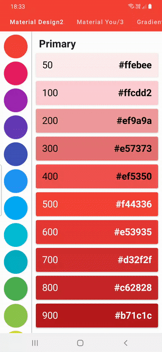
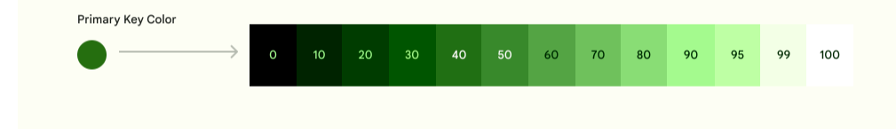

# Jetpack Compose Extended Colors

* Utility library that extends Compose Colors with Material Design2 colors, Color swatches like in
  [Flutter](https://api.flutter.dev/flutter/material/Colors-class.html).

* Material Design 3 tonal palette,
  see [Material Design 3 site](https://m3.material.io/styles/color/the-color-system/key-colors-tones)
  for more information about the Material 3 color system and tonal palettes.

* Rotatable gradients by 45 degrees with aim to add rotation by any angle in the future Utility

* Functions to convert between `androidx.compose.ui.graphics.Color`, HSL, HSV, `RGB`, HCT, and
  colors with nearest **Name** based on distance is in 3D space using `Red`, `Green`, `Blue`.

| M2 Color Swatches | M3 Tone Palettes | | ----------|-----------| -----------| -----------|
| 
|  |

## Material Design 2 Colors && Swatches

### Material Colors


[Material Colors](material_design2.gif material_design3.gif) can be accessed from Red to Brown.
Brown, Grey, and BlueGrey swatches only have primary colors.

```kotlin
val Red50 = Color(0xffFFEBEE)
val Red100 = Color(0xffFFCDD2)
val Red200 = Color(0xffEF9A9A)
val Red300 = Color(0xffE57373)
val Red400 = Color(0xffEF5350)
val Red500 = Color(0xffF44336)
val Red600 = Color(0xffE53935)
val Red700 = Color(0xffD32F2F)
val Red800 = Color(0xffC62828)
val Red900 = Color(0xffB71C1C)

// Accent Colors
val RedA100 = Color(0xffFF8A80)
val RedA200 = Color(0xffFF5252)
val RedA400 = Color(0xffFF1744)
val RedA700 = Color(0xffD50000)
```

For material Swatches

Call any swatch from `ColorSwatch` for instance for Red500 with `ColorSwatch.red` which will return
primary color `Map<Int,Color>`

```kotlin
  val red by lazy {
    linkedMapOf(
        50 to Color(0xffFFEBEE),
        100 to Color(0xffFFCDD2),
        200 to Color(0xffEF9A9A),
        300 to Color(0xffE57373),
        400 to Color(0xffEF5350),
        500 to Color(0xffF44336),
        600 to Color(0xffE53935),
        700 to Color(0xffD32F2F),
        800 to Color(0xffC62828),
        900 to Color(0xffB71C1C)
    )
}
```

to access any color from this map

```
val redSwatch = ColorSwatch.red
val red300 = redSwatch[300]!!
```

Swatch that returns header(50 variants)

```kotlin
val primaryHeaderColors by lazy {
    listOf(
        Color(0xffF44336),
        Color(0xffE91E63),
        Color(0xff9C27B0),
        Color(0xff673AB7),
        Color(0xff3F51B5),
        Color(0xff2196F3),
        Color(0xff03A9F4),
        Color(0xff00BCD4),
        Color(0xff00ACC1),
        Color(0xff4CAF50),
        Color(0xff8BC34A),
        Color(0xffCDDC39),
        Color(0xffFFEB3B),
        Color(0xffFFC107),
        Color(0xffFF9800),
        Color(0xffFF5722),
        Color(0xff795548),
        Color(0xff9E9E9E),
        Color(0xff607D8B)
    )
}
```

## Material Design 3 Tonal Palette
A tonal palette consists of thirteen tones, including white and black. A tone value of 100 is equivalent to the idea of light at its maximum and results in white. Every tone value between 0 and 100 expresses the amount of light present in the color.


| 
From range 0 to 100 
```kotlin
val material3ToneRange = listOf(
    0, 10, 20, 30, 40, 50, 60, 70, 80, 90, 95, 99, 100
)

```

Call
```kotlin
fun getColorTonesList(color: Color): List< Color> {

    val camColor = Cam16.fromInt(color.toArgb())
    val palette: TonalPalette = TonalPalette.fromHueAndChroma(camColor.hue, max(48.0,camColor.chroma))
    val toneList = mutableListOf<Color>()

    material3ToneRange.forEach { shade ->
        toneList.add(Color(palette.tone(shade)))
    }

    return toneList
}
```
that returns list of colors or

```kotlin
fun getColorTonesMap(color: Color): Map<Int, Color> {
    val palette: TonalPalette = TonalPalette.fromInt(color.toArgb())
    val toneMap = linkedMapOf<Int, Color>()

    material3ToneRange.forEach { shade ->
        toneMap[shade] = Color(palette.tone(shade))
    }

    return toneMap
}

```
to get Map with tone keys
